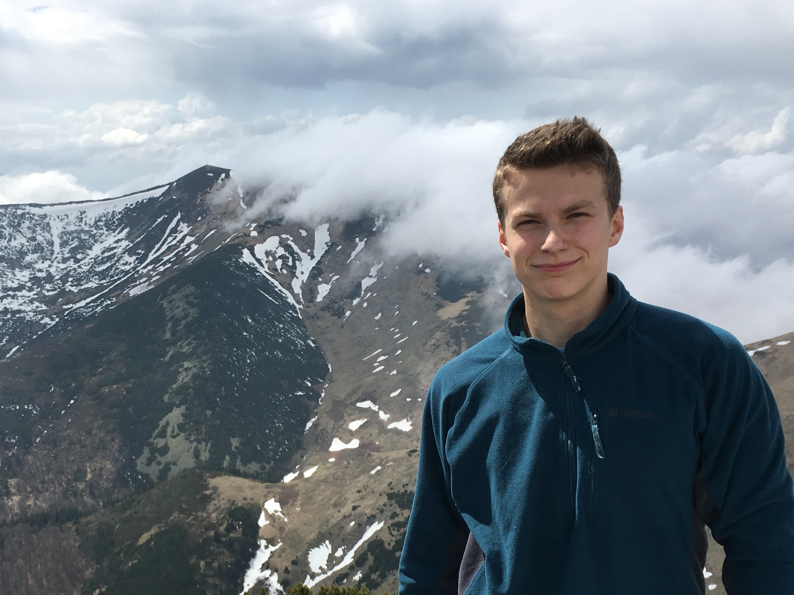

## About Me

My name's Adam and I'm passionate about many things:
- **Information and Computer Engineering**, which I'm currently studying in my third year at [Cambridge University](https://www.cam.ac.uk/)
- **Software Engineering**, which I'm getting into from my more data-sciency experience of being an AI Intern at [Exponea](https://exponea.com/)
- **Volunteering**, being the Director of Communinty at [Hackbridge](https://hackbridge.io/) and an University Admissions Advisor at [Unimak](https://unimak.sk/)
- **Physical Education**, as I'm constanty trying to squeeze in some gym time, go for a run, squat more, or do some weird [movement stuff](https://youtu.be/W0Wr7HsylE0)
- **Sustainability**, **Reading**, **Learning**, **Productivity**, and _all that jazz_

  <i><b>I'd love to get in touch:<b>
    

      
      
    
  

